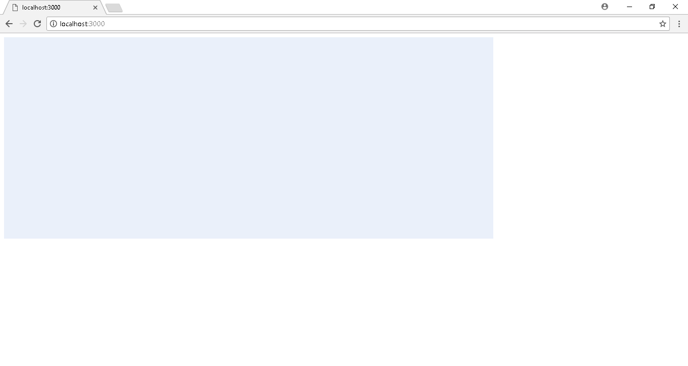
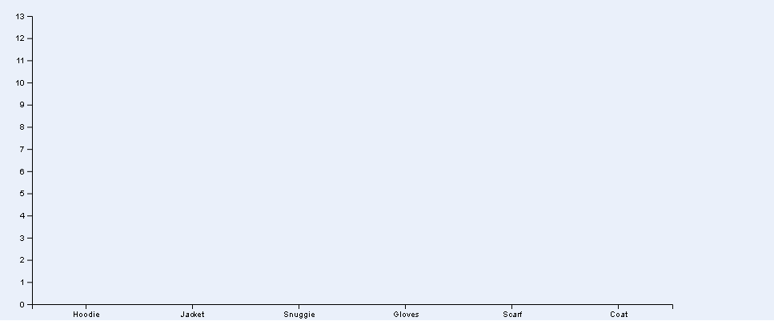
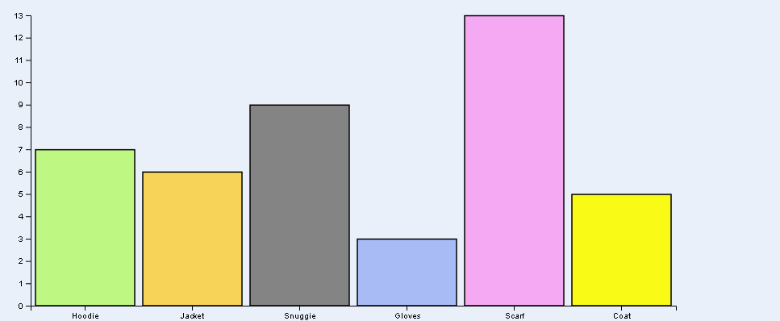
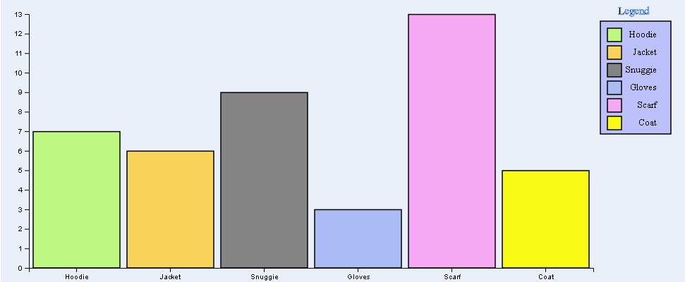
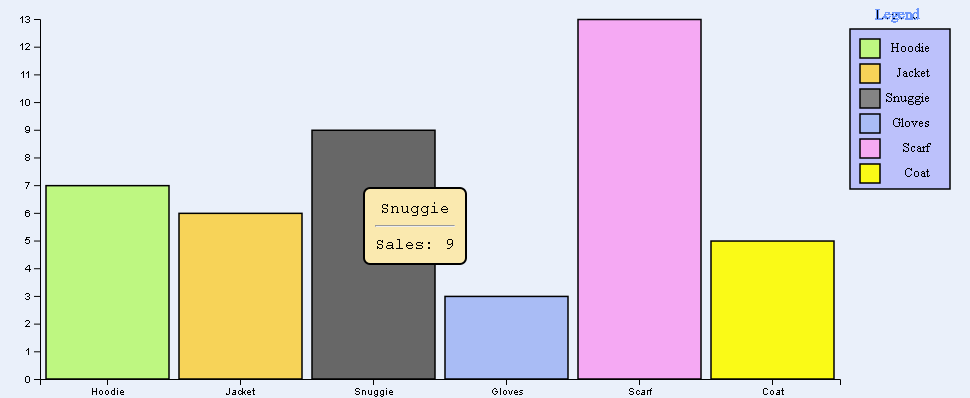
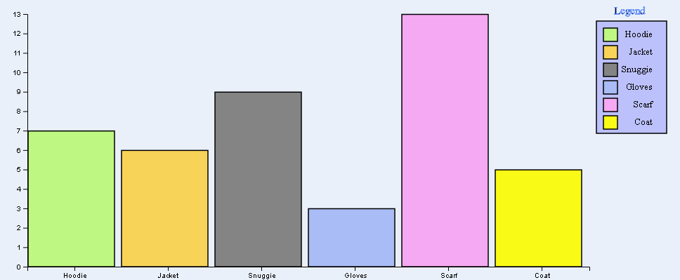

# Exercise 1 - Display a Barchart 
### Author: David Álvarez Palacios
---
---

Display a barchart (start from barchart refactor sample):
* Adding space between columns.
* Adding colors to each bar.
* Adding a legend.
* Showing the chart vertically.

**IMPORTANT**
* Create the project in Github.
* Include the link to the Github report.
* This github report must have a readme.md explaining the goal of the project and how to start it.

---
---

### FILES
* data.json
* index.html
* styles.css
* data.js
* utils.js
* main.js
* bars.js
* legend.js

---
---

**STEPS**
### Lite web server
In order to avoid that Chrome will block the ajax requests as a security requests, we will up a lite server. To do that, we have to follow the next steps:
1. execute _npm init_
```bash
npm init
```
2. After filling the data requested in init, we are going to install _lite-server_.
```
npm install lite-server --save-dev
```
3. Now we can start/stop the server everytime that we need
```
npm start
npm stop
```

---

### data.json
We will use the following data in json format

```
[
    { "product": "Hoodie", "sales": 7, "color": "#BEF781" },
    { "product": "Jacket", "sales": 6, "color": "#F7D358" },
    { "product": "Snuggie", "sales": 9, "color": "#848484" },
    { "product": "Gloves", "sales": 3, "color": "#A9BCF5" },
    { "product": "Scarf", "sales": 13, "color": "#F5A9F2" },
    { "product": "Coat", "sales": 5, "color": "#FAFA17" }
]
```

Chart was coded to support add or remove new products (always following the same format that the default ones).

The attribute **color** define the **color bar** for the product (we will see where is exactly used this attribute in the bars.js file section.

---

### index.html
We are including the following js/css links:
- **d3.v4.min.js**: d3 v4
- **queue.v1.min.js**: to manage asynchronous calls
- **styles.css**, **data.js**, **utils.js**, **bars.js**, **legend.js**, **main.js**: own files that will be explained in the next sections.

---

### styles.css
The following classes were included to the styles file:
- **svgStyle**: To give to the chart a background color.
- **toolTip**: style for the tooltip showed when our mouse is over a bar. With this style we can set attributes about the "box" (color, border stroke and radius, size...) and the font (family, align, ...).
- **legend**: To give font style to the legend descriptions.
- **legendTitle**: To give style to the font used by the Title _Legend_.
- **legendRect**: To give a color to the rect component that surround the legend.
- **chartStroke**: Stroke used in the bars to highlight them.

---

### data.js
In this file we will read the data from the _data.json_ file. To do that, we will use the **d3.json** functionallity. To avoid synchronization problems, we add the load to a queue. So, when the load is finished, is executed a _ready_ function that start the chart building
```
var totalSales = null;

queue()
  .defer(d3.json, "data.json")
  .await(ready);

// We must wait to read the data before start the chart built
function ready(error, data) {
    totalSales = data;
    buildChart();
}
```

---

### utils.js
This is a file that will contain some constants used to code the exercise. The idea is try to give a name to some numbers in order to be easy to read some attributes customization.

---

### main.js
This is the main file. Here we setup each chart part (scales, axis, bars, legend). We will try to explain fucntion by function the code:

**buildChart()**
This is the main function. The point where the building start. It is called from the _data.js_ file just when the _data.json_ file is loaded.This function call one by one all the functions needed to build the bar chart.
```
function buildChart() {
    setupCanvasSize();
    appendSvg("body");
    setupXScale();
    setupYScale();
    appendXAxis();
    appendYAxis();
    appendChartBars();
    appendLegend();
}
```

**setupCanvasSize()**
Here we set the margins, the width and the height that the bar chart will have.
```
function setupCanvasSize() {
    margin = {top: MARGIN_TOP, left: MARGIN_LEFT, bottom: MARGIN_BOTTOM, right: MARGIN_RIGHT};
    width = SVG_WIDTH - margin.left - margin.right;
    height = SVG_HEIGHT - margin.top - margin.bottom;
}
```

**appendSvg(domElement)**
The first real step is done in this function and is add to the _domElement_ (**body**) a **svg** using the size variables defined before. Also, the _svgStyle_ is applied and the svg is including in a grou to be translate in order to give some space on top and on the left.
```
function appendSvg(domElement) {
    svg = d3.select(domElement).append("svg")
            .attr("width", width + margin.left + margin.right)
            .attr("height", height + margin.top + margin.bottom)
            .attr("class", "svgStyle")
            .append("g")
            .attr("transform",`translate(${margin.left}, ${margin.top})`);
}
```


**setupXScale()**
Here we define the scale for the X axis (getting every product in totalSales array). This will be a discrete scale (for this case one per product). The scale will be **from 0 to the X axis width**.
```
function setupXScale()
{
    // We are using discrete values for the X axis (products)
    x = d3.scaleBand()
            .rangeRound([0, width])
            .domain(totalSales.map(function(d, i) {
                return d.product;
            }));
}
```

**setupYScale()**
Here we define the scale for the Y axis (getting the max value for the sales property in all the products loaded from _data.json_).
```
function setupYScale()
{
    var maxSales = d3.max(totalSales, function(d, i) {
        return d.sales;
    });
}
```
This will be a continuos scale (**from 0 to maxSales**).
```
function setupYScale()
{
    var maxSales = d3.max(totalSales, function(d, i) {
        return d.sales;
    });

+    // We are using continuos values for the Y axis (number of sales)
+    y = d3.scaleLinear()
+            .range([height, 0])
+            .domain([0, maxSales]);
}
```

**appendXAxis()**
In this function we are adding the X axis to the bar chart. To do it, we create a new group and traslate it to the bottom (the chart height). Also, the scale for the X axis is set here (d3.axisBottom(x)).
```
function appendXAxis() {
    svg.append("g")
        .attr("transform",`translate(0, ${height})`)
        .call(d3.axisBottom(x));
}
```

**appendYAxis()**
In this function we are adding the Y axis to the bar chart. To do it, we create a new group (this time is not necessary traslete it, is already on the left-top corner). Also, the scale for the Y axis is set here (d3.axisLeft(y)).
```
function appendYAxis() {
    svg.append("g")
        .call(d3.axisLeft(y));
}
```

Now we have the axis.


**appendChartBars()**
This function is responsible for creating the bars and the interactions over them. There are several actions to configure the bars (because of that, we have a specific file to work with the bars (**bars.js**)) that we will explain in the next section.

This function will call the different method needed to build the bars and add to them interactions. I think that the functions names are clearly enough so I will not enter in a deep description of them here.
```
function appendChartBars()
{
    // Prepare a group per each rect and bind data stored in the totalSales var
    var rects = svg.selectAll('rect').data(totalSales);
    // Get access to all the elements (rects)
    var newRects = rects.enter();
    // Append rects to the svg
    var bars = newRects.append('rect');

    setupToolTip();
    addRect(bars);
    addColor(bars);
    addStroke(bars);
    addMouseEvents(bars);
}
```
Now we have also the bars.


**appendLegend()**
The philosophy in this function is the same than in the function before. It is the responsible to create the legend, but all the actions are in a specific file (**legend.js**).

I think that the functions names are clearly enough so I will not enter in a deep description of them here.
```
function appendLegend()
{   
    setupCanvasLegend();    
    setupLegendScale();
    
    var legend = createLegend(svg);
    addLegendElements(legend);
    addLegendText(legend);
}
```
Now we have the full chart.


---

### bars.js
This file contains all the function required to create and give interaction over the bars. Before start to explain every function here, let me remember the **appendChartBars()** function
```
function appendChartBars()
{
    // Prepare a group per each rect and bind data stored in the totalSales var
    var rects = svg.selectAll('rect').data(totalSales);
    // Get access to all the elements (rects)
    var newRects = rects.enter();
    // Append rects to the svg
    var bars = newRects.append('rect');

    setupToolTip();
    addRect(bars);
    addColor(bars);
    addStroke(bars);
    addMouseEvents(bars);
}
```

Ok, so now, we will explain those 5 steps to generate the bars:


**1.- setupToolTip()**
Basically is create the tooltip that will be showed when we pass with the mouse over one of the bars. The tooltip is a div that we will modified the content with the correct information (we will see that when we explain the _onmousemove_ action).

Also, the tooltip will have the **toolTip** class to give it style.
```
function setupToolTip()
{
    tooltip = d3.select("body").append("div").attr("class", "toolTip");
}
```
Tooltip example:


**2.- addRect()**
This is the function that add the bars to the chart. Each bar have 4 parameters, **x**, **width**, **y** and **height**. We have defined a function to get the correct value of each one for each bar.
```
function addRect(bars) {
    bars.attr('x', setBarStartPositionX)
        .attr('width', setBarEndPositionX)
        .attr('y', setBarStartPositionY)    
        .attr('height', setBarEndPositionY);
}
```

**x** and **width** define the position and width of each bar.In order to add space beetween each bar we simply subtract to the size given by the _Xscale_ some pixels (10 in our case). Doing only that we don`t have the bars centered.
```
function setBarEndPositionX(d, i) {
    return x.bandwidth() - 10;
}
```
Tooltip example:


for this reasen we add some pixels (in this case 5) to the **x** position (this position is defined by the product that is refered in the specific bar).
```
function setBarStartPositionX(d, i) {
    return x(d.product) + 5;
}
```
Tooltip example:


For the **y** and **height** parameters we do something similar (add and substract 0.5 in order to separete a little the bar for the X axis and don't exceed the height). The heihgt is defined by the value in the sales property (_YScale_)
```
function setBarStartPositionY(d, i) {
    return y(d.sales) + 0.5;
}

function setBarEndPositionY(d, i) {
    return height - y(d.sales) - 0.5;
}
```

