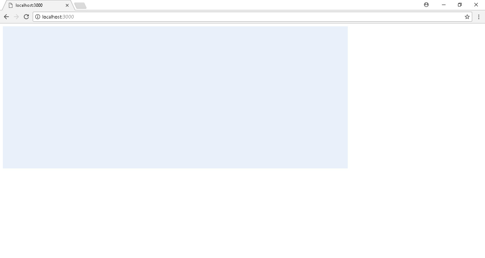
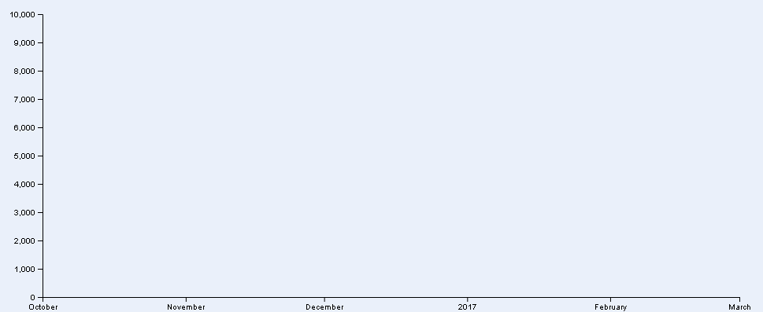
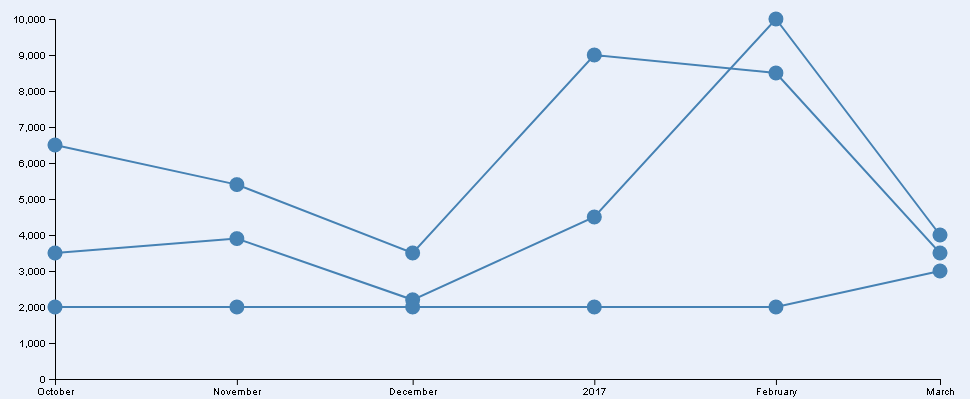
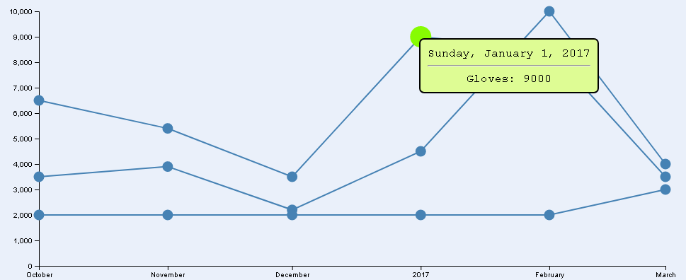
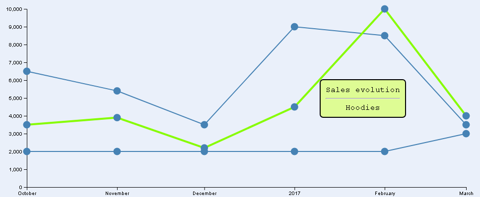

# Exercise 2 - Create a Line chart and add dots and interaction 
### Author: David Álvarez Palacios
---
---

Create a Line chart add dots and interaction (whenever you click on the dots display information).
As an alternative you can propose another similar excercise (please original samples no copy paste).

**IMPORTANT**
* Create the project in Github.
* Include the link to the Github report.
* This github report must have a readme.md explaining the goal of the project and how to start it.

---
---

### FILES
* data.json
* index.html
* styles.css
* data.js
* utils.js
* main.js
* lines.js

---
---

**STEPS**
### Lite web server
In order to avoid that Chrome will block the ajax requests as a security requests, we will up a lite server. To do that, we have to follow the next steps:
1. execute _npm init_
```
npm init
```
2. After filling the data requested in init, we are going to install _lite-server_.
```
npm install lite-server --save-dev
```
3. Next open **package.json** file and modify the _scripts_ field
```
"scripts": {
    "start": "lite-server"
  }
```
4. Now we can start/stop the server everytime that we need
```
npm start
npm stop
```

---

### data.json
We will use the following data in json format

```
[
    { "month": 1475272800000,"Gloves": 6500, "Hoodies": 3500, "Jackets": 2000 },
    { "month": 1477954800000, "Gloves": 5400, "Hoodies": 3900, "Jackets": 2000 },
    { "month": 1480546800000, "Gloves": 3500, "Hoodies": 2200, "Jackets": 2000 },
    { "month": 1483225200000, "Gloves": 9000, "Hoodies": 4500, "Jackets": 2000 },
    { "month": 1485903600000, "Gloves": 8500, "Hoodies": 10000, "Jackets": 2000 },
    { "month": 1488322800000, "Gloves": 3500, "Hoodies": 4000, "Jackets": 3000 }
]
```

Chart was coded to support add or remove new months to the temporal serie (adding rows) and also new product sales (adding new field to each row). Of course **always following the same format that the default ones**.

---

### index.html
We are including the following js/css links:
- **d3.v4.min.js**: d3 v4
- **queue.v1.min.js**: to manage asynchronous calls
- **styles.css**, **data.js**, **utils.js**, **lines.js**, **main.js**: own files that will be explained in the next sections.

---

### styles.css
The following classes were included to the styles file:
- **svgStyle**: To give to the chart a background color.
- **line**: Will be the temporal serie (lines) style.
- **lineHover**: Will be the temporal serie (lines) style, when the mouse is over them.
- **dot**: Will be the temporal serie points style.
- **dotHover**: Will be the temporal serie points style, when the mouse is over them.
- **toolTip**: style for the tooltip showed when our mouse is over a line or dot. With this style we can set attributes about the "box" (color, border stroke and radius, size...) and the font (family, align, ...).

---

### data.js
In this file we will read the data from the _data.json_ file. To do that, we will use the **d3.json** functionallity. To avoid synchronization problems, we add the load to a queue. 
```
queue()
  .defer(d3.json, "data.json")
  .await(ready);
```

So, when the load is finished, is executed the _ready_ function that prepare the data and start the chart building (**buildChart()** is the main function in the main file).
```
function ready(error, data) {
    totalSales = data;

    // Get the field names
    var dataKeys = Object.keys(totalSales[0]);    
    
    // Get data for every line
    for(var i = 1, len = dataKeys.length; i < len; i++){
        dataList.push(totalSales.map(data => ({month: data.month, name: dataKeys[i], sales: data[dataKeys[i]]})));
    }

    // Get data for every point
    for(var i = 0, len = totalSales.length; i < len; i++) {
        for(var j = 1, lenj = dataKeys.length; j < lenj; j++) {
            pointList.push({month: totalSales[i].month, name: dataKeys[j], sales: totalSales[i][dataKeys[j]]});
        }
    }

    // Create the chart
    buildChart();
}
```

To prepare the data we create two lists, one with the **lines** data and other one with the **dots** data. Three steps to do that:
- Get the field names in a row (as we said before, we don't validate the format, we are trusting that the format is correct.
```
var dataKeys = Object.keys(totalSales[0]);
```

- Generate the list with the data for the temporal series (the lines). To the that we generate an Array for every line with the temporal serie information
-- **month**: With the month information from the json file. Will be in milliseconds.
-- **name**: With the temporal serie name. Will be the field name in the json file.
-- **sales**: With the value for the specific temporal serie.
```
for(var i = 1, len = dataKeys.length; i < len; i++){
        dataList.push(totalSales.map(data => ({month: data.month, name: dataKeys[i], sales: data[dataKeys[i]]})));
    }
```

- Generate the list with the data for the points in every temporal serie. To do that we generate an Array with an entry per each point (that means: if we have 3 lines series with 6 points each one, we will have an array with 18 entries). The same concept for the **month**, **name** and **sales** than before.
```
for(var i = 0, len = totalSales.length; i < len; i++) {
        for(var j = 1, lenj = dataKeys.length; j < lenj; j++) {
            pointList.push({month: totalSales[i].month, name: dataKeys[j], sales: totalSales[i][dataKeys[j]]});
        }
    }
```

---

### utils.js
This is a file that will contain some constants used to code the exercise. The idea is try to give a name to some numbers in order to be easy to read some attributes customization.
```
// SVG constants
var SVG_WIDTH = 970;
var SVG_HEIGHT = 400;

// Line Chart Constants
var MARGIN_TOP = 20;
var MARGIN_LEFT = 55;
var MARGIN_BOTTOM = 20;
var MARGIN_RIGHT = 30; 

// Dots Constants
var DOT_RADIOUS = 7.5;
var DOT_RADIOUS_INCREASE_HOVER = 2;
```

---

### main.js
This is the main file. Here we setup each chart part (scales, axis, lines). We will try to explain fucntion by function the code:

**buildChart()**

This is the main function. The point where the building start. It is called from the _data.js_ file just when the _data.json_ file is loaded.This function call one by one all the functions needed to build the line chart.
```
function buildChart() {
  setupCanvasSize();
  appendSvg("body");
  setupXScale();
  setupYScale();
  appendXAxis();
  appendYAxis();
  appendLineCharts();
}
```

**setupCanvasSize()**

Here we set the margins, the width and the height that the line chart will have.
```
function setupCanvasSize() {
  margin = {top: MARGIN_TOP, left: MARGIN_LEFT, bottom: MARGIN_BOTTOM, right: MARGIN_RIGHT};
  width = SVG_WIDTH - margin.left - margin.right;
  height = SVG_HEIGHT - margin.top - margin.bottom;
}
```

**appendSvg(domElement)**

The first real step is done in this function and is add to the _domElement_ (**body**) a **svg** using the size variables defined before. Also, the _svgStyle_ is applied and the svg is including in a grou to be translate in order to give some space on top and on the left.
```
function appendSvg(domElement) {
  svg = d3.select(domElement).append("svg")
              .attr("width", width + margin.left + margin.right)
              .attr("height", height + margin.top + margin.bottom)
              .attr("class", "svgStyle")
              .append("g")
              .attr("transform",`translate(${margin.left}, ${margin.top})`);
}
```


**setupXScale()**

Here we define the scale for the X axis (getting every month in totalSales array). This will be a discrete scale (for this case one per month). The scale will be **from 0 to the X axis width**.
```
function setupXScale()
{
  // We are using discrete values for the X axis (months)
  x = d3.scaleTime()
        .range([0, width])
        .domain(d3.extent(totalSales, function(d) { 
            return d.month
        }));
}
```

**setupYScale()**

Here we define the scale for the Y axis (getting the max value for the sales property in all the months loaded from _data.json_).
```
function setupYScale()
{
    var maxSales = d3.max(dataList, function(d, i) {
        return d3.max(d, function(d, i) {
            return d.sales;
        }); 
    });
}
```
This will be a continuos scale (**from 0 to maxSales**).
```
function setupYScale()
{
    var maxSales = d3.max(totalSales, function(d, i) {
        return d.sales;
    });

+    // We are using continuos values for the Y axis (number of sales)
+    y = d3.scaleLinear()
+            .range([height, 0])
+            .domain([0, maxSales]);
}
```

**appendXAxis()**

In this function we are adding the X axis to the line chart. To do it, we create a new group and traslate it to the bottom (the chart height). Also, the scale for the X axis is set here (d3.axisBottom(x)).
```
function appendXAxis() {
  svg.append("g")
      .attr("transform",`translate(0, ${height})`)
      .call(d3.axisBottom(x));
}
```

**appendYAxis()**

In this function we are adding the Y axis to the line chart. To do it, we create a new group (this time is not necessary traslete it, is already on the left-top corner). Also, the scale for the Y axis is set here (d3.axisLeft(y)).
```
function appendYAxis() {
  svg.append("g")
      .call(d3.axisLeft(y));
}
```

Now we have the axis.


**appendLineCharts()**

This function is responsible for creating the lines/dots and the interactions over them. There are several actions to configure the lines (because of that, we have a specific file to work with the lines and their dots (**lines.js**)) that we will explain in the next section.

This function will call the different method needed to build the lines and dots and add to them interactions. I think that the functions names are clearly enough so I will not enter in a deep description of them here.
```
function appendLineCharts()
{
  setupToolTip();
  createLines(svg);
  createDots(svg);  
}
```
Now we have also the lines and dots.


---

### lines.js
This file contains all the function required to create and give interaction over the lines/dots. Before start to explain every function here, let me remember the **appendLineCharts()** function
```
function appendLineCharts()
{
  setupToolTip();
  createLines(svg);
  createDots(svg);  
}
```

Ok, so now, we will explain those 3 steps to generate the lines and dots:

**1.- setupToolTip()**

Basically is create the tooltips that will be showed when we pass with the mouse over one of the lines or over one of the dots. The tooltip is a div that we will modified the content with the correct information (we will see that when we explain the specific mouse action).

Also, the tooltip will have the **toolTip** class to give it style.
```
function setupToolTip()
{
    tooltip = d3.select("body").append("div").attr("class", "toolTip");
    linetooltip = d3.select("body").append("div").attr("class", "toolTip");
}
```
Tooltip examples:



**2.- createLines()**
This is the function that add the lines to the chart. The idea is define a line using the month value as coordinate x and the sales value as coordinate y and draw the line creating a path.
```
function createLines(svg) {
    // define the line
    var valueline = d3.line()
                        .x(function(d) { return x(d.month); })
                        .y(function(d) { return y(d.sales); });

    // add all lines to teh svg (datalist contains that information)
    var lines = svg.selectAll(".line")
                .data(dataList)
                .enter().append("g");

    // Create a path per line
    lines.append("path")
                .attr("class", "line")
                .attr("d", valueline)
                .on("mouseover", showLineHover)
                .on("mouseout", hideHoverLine)
                .on("mousemove", showLineTooltip);
}
```

How we said before, the path will be the "physical" line. It will use one of our classes **line** to get the style. The attribute **d** is the one that will contain the instrucctions to create the path. In our case, the x and y points:
```
var valueline = d3.line()
                        .x(function(d) { return x(d.month); })
                        .y(function(d) { return y(d.sales); });
```

For the mouse events, we have generated a function per each one, in order to have a cleaner code.We add functionallity to the **mouseover** (showing a hover), **mousemove** (showing the tooltip) and **mouseout** (hiding the hover and the tooltip).

Each event was coded in a different method. On the **mouseover** we call the **showLineHover** method. The idea is simply: as hover we want to resalt the line where the mouse is over. To do that, we increase the line stroke and also change it color (both actions are defined in the style class **lineHover**)
```
function showLineHover(d) {
    d3.select(this)
      .attr("class", "lineHover");
}
```

On the **mousemove** we call the **showLineTooltip** method. The idea is set the current mouse position and display the tooltip. And, of course, set the information (The temporal serie name) to the line where the mouse is on. The access to the name  is not the most elegant one, because we are accessing directly to the first row in the array always (all rows have the same value in the field name).
```
function showLineTooltip(d) {
    linetooltip.style("left", d3.event.pageX + "px")
            .style("top", d3.event.pageY + "px")
            .style("display", "inline")
            .html("Sales evolution" + "<hr>" + d[0].name);
}
```

Finally, on the **mouseout** we call the **hideHoverLine** method. The idea is undo the changes over the lines done by the previous method. So, in this case, we simply get again the original color and stroke of the line using the orininal class style **line**. And, of course setting the tooltip display to none.
```
function hideHoverLine(d) {
    d3.select(this)
      .attr("class", "line");

    hideLineTooltip();
}
function hideLineTooltip() {
    linetooltip.style("display", "none");
}
```

**2.- createDots()**
This is the function that add the dots to the lines in the chart. The idea is create all the dots independently (remember that we have all of them in the list arrays **pointList**) and put them on the chart using the x and y scale. We mean, instead of be part of the lines, are part of the chart.
```
function createDots(svg) {  
    var dots =  svg.selectAll("circle")
        .data(pointList)
        .enter().append("circle")
        .attr("class", "dot")      
        .attr("cx", function(d) { return x(d.month); })
        .attr("cy", function(d) { return y(d.sales); })
        .attr("r", DOT_RADIOUS);
        
    addDotMouseEvents(dots);    
}
```

So, we will create all the points as circles in the chart, give the the class style **dot** and colocate them in the correct place using the x scale for the months and the y scale for the sales (**cx** and **cy** atributes). Finally, assing to the points the radius size.

Finally, we add the mouse event actions to the dots. We have created a specific function to do it **addDotMouseEvents**:
```
function addDotMouseEvents(dots) {
    dots.on("mouseover", showDotHover)
        .on("mouseout", hideDotHoverAndTooltip)
        .on("click", showTooltip);
}
```

For the mouse events, we have generated a function per each one, in order to have a cleaner code.We add functionallity to the **mouseover** (showing a hover), **click** (showing the tooltip) and **mouseout** (hiding the hover and the tooltip).

Each event was coded in a different method. On the **mouseover** we call the **showDotHover** method. The idea is simply: as hover we want to resalt the dot where the mouse is over. To do that, we increase the circle radious (we apply the own **DOT_RADIOUS_INCREASE_HOVER** factor) and also change it color (defined in the style class **dotHover**)
```
function showDotHover(d) {
    d3.select(this)
      .attr("r", DOT_RADIOUS * DOT_RADIOUS_INCREASE_HOVER)
      .attr("class", "dotHover");
}
```

On the **click** we call the **showTooltip** method. The idea is set the current mouse position and display the tooltip. And, of course, set the information (The current month and the sales in that month for the current temporal serie name) to the dot where the mouse is on.
```
function showTooltip(d) {
    tooltip.style("left", d3.event.pageX + "px")
            .style("top", d3.event.pageY + "px")
            .style("display", "inline")
            .html(dateToString(d.month) + "<hr>" + d.name + (": ") + d.sales);
}
```

We have to remember that the month where in millisecons, so to give it a human friendly vision we have create the **dateToString** method, where we only use the _toLocaleDateString_ function and a set of options that this function have.
```
function dateToString(millis) {
    var options = {  
        weekday: "long", 
        year: "numeric", 
        month: "long",  
        day: "numeric"  
    }; 

    var date = (new Date(millis)).toLocaleDateString('en-US', options);  

    return date;
}
```

Finally, on the **mouseout** we call the **hideDotHoverAndTooltip** method. The idea is undo the changes over the dots done by the previous method. So, in this case, we simply get again the original color and circle radious of the dot using the orininal class style **dot**. And, of course setting the tooltip display to none.
```
function hideDotHoverAndTooltip(d) {
    d3.select(this)
      .attr("r", DOT_RADIOUS)
      .attr("class", "dot");
  
    hideTooltip();
}
function hideTooltip() {
    tooltip.style("display", "none");
}
```
