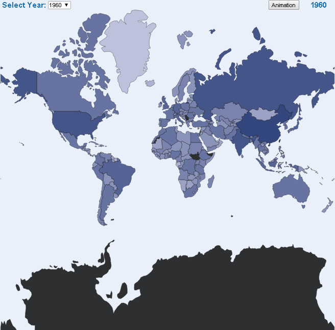

# Exercise 3 - Create a world map chart  
### Author: David Álvarez Palacios
---
---

Based on the population country and year we got on the first nvd3 sample (1960 - 2016 all countries in the world), create a world map chart and combo to pick the year and display data as a plus create an animated version, transitioning from 1960 to 2016.

Alternative, propose an advance map scenario (spain or europe), and use other data source (please do not just copy paste a single sample, in that case we will request additional custom steps).

**IMPORTANT**
* Create the project in Github.
* Include the link to the Github report.
* This github report must have a readme.md explaining the goal of the project and how to start it.

---
---

### SCREENSHOT



---
---

### FILES
* country-data.json
* world_countries.json
* index.html
* styles.css
* d3-tip
* utils.js
* main.js

---
---

**STEPS**
### Lite web server
In order to avoid that Chrome will block the ajax requests as a security requests, we will up a lite server. To do that, we have to follow the next steps:
1. execute _npm init_
```
npm init
```
2. After filling the data requested in init, we are going to install _lite-server_.
```
npm install lite-server --save-dev
```
3. Next open **package.json** file and modify the _scripts_ field
```
"scripts": {
    "start": "lite-server"
  }
```
4. Now we can start/stop the server everytime that we need
```
npm start
npm stop
```

---

### country-data.json
Contains the population data by year and country

```
[
    {"Country Code": "ARB", "Country Name": "Arab World", "Value": 92490932.0, "Year": 1960},
    {"Country Code": "ARB", "Country Name": "Arab World", "Value": 95044497.0, "Year": 1961},
    {"Country Code": "ARB", "Country Name": "Arab World", "Value": 97682294.0, "Year": 1962}
    ...
]
```

---

### world_countries.json
Contains the border data by country

```
[
{"type":"FeatureCollection","features":[ {"type":"Feature","properties":{"name":"Afghanistan"},"geometry":{"type":"Polygon","coordinates":[[[61.210817,35.650072],[62.230651,35.270664],[62.984662,35.404041],[63.193538,35.857166],[63.982896,36.007957],[64.546479,36.312073],[64.746105,37.111818],[65.588948,37.305217],[65.745631,37.661164],[66.217385,37.39379],[66.518607,37.362784],[67.075782,37.356144],[67.83,37.144994],[68.135562,37.023115],[68.859446,37.344336],[69.196273,37.151144],[69.518785,37.608997],[70.116578,37.588223],[70.270574,37.735165],[70.376304,38.138396],[70.806821,38.486282],[71.348131,38.258905],[71.239404,37.953265],[71.541918,37.905774],[71.448693,37.065645],[71.844638,36.738171],[72.193041,36.948288],[72.63689,37.047558],[73.260056,37.495257],[73.948696,37.421566],[74.980002,37.41999],[75.158028,37.133031],[74.575893,37.020841],[74.067552,36.836176],[72.920025,36.720007],[71.846292,36.509942],[71.262348,36.074388],[71.498768,35.650563],[71.613076,35.153203],[71.115019,34.733126],[71.156773,34.348911],[70.881803,33.988856],[69.930543,34.02012],[70.323594,33.358533],[69.687147,33.105499],[69.262522,32.501944],[69.317764,31.901412],[68.926677,31.620189],[68.556932,31.71331],[67.792689,31.58293],[67.683394,31.303154],[66.938891,31.304911],[66.381458,30.738899],[66.346473,29.887943],[65.046862,29.472181],[64.350419,29.560031],[64.148002,29.340819],[63.550261,29.468331],[62.549857,29.318572],[60.874248,29.829239],[61.781222,30.73585],[61.699314,31.379506],[60.941945,31.548075],[60.863655,32.18292],[60.536078,32.981269],[60.9637,33.528832],[60.52843,33.676446],[60.803193,34.404102],[61.210817,35.650072]]]},"id":"AFG"},
{"type":"Feature","properties":{"name":"Angola"},"geometry":{"type":"MultiPolygon","coordinates":[[[[16.326528,-5.87747],[16.57318,-6.622645],[16.860191,-7.222298],[17.089996,-7.545689],[17.47297,-8.068551],[18.134222,-7.987678],[18.464176,-7.847014],[19.016752,-7.988246],[19.166613,-7.738184],[19.417502,-7.155429],[20.037723,-7.116361],[20.091622,-6.94309],[20.601823,-6.939318],[20.514748,-7.299606],[21.728111,-7.290872],[21.746456,-7.920085],[21.949131,-8.305901],[21.801801,-8.908707],[21.875182,-9.523708],[22.208753,-9.894796],[22.155268,-11.084801],[22.402798,-10.993075],[22.837345,-11.017622],[23.456791,-10.867863],[23.912215,-10.926826],[24.017894,-11.237298],[23.904154,-11.722282],[24.079905,-12.191297],[23.930922,-12.565848],[24.016137,-12.911046],[21.933886,-12.898437],[21.887843,-16.08031],[22.562478,-16.898451],[23.215048,-17.523116],[21.377176,-17.930636],[18.956187,-17.789095],[18.263309,-17.309951],[14.209707,-17.353101],[14.058501,-17.423381],[13.462362,-16.971212],[12.814081,-16.941343],[12.215461,-17.111668],[11.734199,-17.301889],[11.640096,-16.673142],[11.778537,-15.793816],[12.123581,-14.878316],[12.175619,-14.449144],[12.500095,-13.5477],[12.738479,-13.137906],[13.312914,-12.48363],[13.633721,-12.038645],[13.738728,-11.297863],[13.686379,-10.731076],[13.387328,-10.373578],[13.120988,-9.766897],[12.87537,-9.166934],[12.929061,-8.959091],[13.236433,-8.562629],[12.93304,-7.596539],[12.728298,-6.927122],[12.227347,-6.294448],[12.322432,-6.100092],[12.735171,-5.965682],[13.024869,-5.984389],[13.375597,-5.864241],[16.326528,-5.87747]]],[[[12.436688,-5.684304],[12.182337,-5.789931],[11.914963,-5.037987],[12.318608,-4.60623],[12.62076,-4.438023],[12.995517,-4.781103],[12.631612,-4.991271],[12.468004,-5.248362],[12.436688,-5.684304]]]]},"id":"AGO"},
...
]
```

---

### index.html
We are including the following js/css links:
- **d3.v4.min.js**: d3 v4
- **queue.v1.min.js**: to manage asynchronous calls
- **topojson.v1.min.js**: to manage the map representation
- **d3-tip.js**: Library to manage tooltips
- **styles.css**,**utils.js**, **main.js**: own files that will be explained in the next sections.

Also, the body structure in our *index.html* try to order some components used in the solution.

```
<body>
      <div id="column" class="columnStyle">
        <div id="RowTop" class="selectStyle headerStyle">
          <div id="yearSelection" class="yearSelectionStyle"></div>
          <div id="mapAnimation" class="animationSectionStyle mapAnimationStyle">
            <div id="animationButton" class="animationButtonStyle"></div>
            <div id="AnimationText" class="animationTextStyle"></div>
          </div>
        </div>
        <div id="RowBottom"></div>
      </div>
  </body>
```
The idea is divide the page in a main colunm that will contain two rows:
- **RowTop**: with the user interaction secction. This secction have to main parts:
-- **yearSelection**: With the combobox to select the year that we want to see in the map
-- **mapAnimation**: With the button (*animationButton*) that start an animation over all the years and a text (*AnimationText*) that will contains the current year in every moment.
- **RowBottom**: with the map

**In the following sections we will explain how to add element to those div.**

---

### styles.css
The following classes were included to the styles file:
- **svgStyle**: To give to the chart a background color.
- **columnStyle**: To give to the main column (*column* id in the *index.html* file) a table format in order to get two rows (for the header and for the map)
- **headerStyle**: To give to the header row (*RowTop* id in the *index.html* file) a flex format in order to order the items in this row.
- **yearSelectionStyle**: To give to the year selection section (*yearSelection* id in the *index.html* file) the 80% of the row size.
- **animationSectionStyle**: To give to the animation section (*mapAnimation* id in the *index.html* file) the 20% of the row size.
- **mapAnimationStyle**: To give to the animation section (*mapAnimation* id in the *index.html* file) a flex format in order to order the items in this section.
- **animationButtonStyle**: To give to the year selection section (*animationButton* id in the *index.html* file) the 50% of the row size.
- **animationTextStyle**: To give to the animation section (*AnimationText* id in the *index.html* file) the 50% of the row size.
- **selectStyle**: To give to the header row (*RowTop* id in the *index.html* file) the same background color than the map.
- **comboStyle**: To align vertically the combobox.
- **yearStyle**: To give format to the texts in the header row.
- **countriesStyle**: To give opacity to the map and set the borders stroke with and color.

There others styles used and created by the **d3-tip.js** library. Those styles are a third party. 

---

### utils.js
This is a file that will contain some constants used to code the exercise. The idea is try to give a name to some numbers and texts in order to be easy to read some attributes customization.
```
// SVG constants
var SVG_WIDTH = 820;
var SVG_HEIGHT = 785;

// Color range constants
var POPULATION_RANGES = [10000, 100000, 500000, 1000000, 5000000, 10000000, 50000000, 100000000, 500000000, 1500000000];
//var POPULATION_RANGES_COLOR = ["rgb(247,251,255)", "rgb(222,235,247)", "rgb(198,219,239)", "rgb(158,202,225)", "rgb(107,174,214)", "rgb(66,146,198)", "rgb(33,113,181)", "rgb(8,81,156)", "rgb(8,48,107)", "rgb(3,19,43)"];
var POPULATION_RANGES_COLOR = ["rgb(202,201,228)", "rgb(180,182,213)", "rgb(158,163,198)", "rgb(136,143,184)", "rgb(115,124,169)", "rgb(93,105,154)", "rgb(71,85,140)", "rgb(49,66,125)", "rgb(27,47,110)", "rgb(6,28,96)"];

// Years constants
var MAX_YEAR = 9999;
var MIN_YEAR = 0;
var TEXT = "Select Year: ";

// Animation constants
var TEXT_ANIMATION = "Animation";

// Refresh constants
var REFRESH_DURATION = 750;

// Map Trasnlation Constants
var POSITION_X = 0;
var POSITION_Y = -147;
```

---

### main.js
This is the main file. Here we setup each map part (the user interaction section, the data, the map...). We will try to explain block to block all the code:

**Set tooltips**

In this section, we create a variable with the tooltip format.The tooltip will show 3 fields: **Country Name**, **Population** and **Year**. The tooltip is based in the 3PP *d3-tip.js*, so the styles directly use the **d3-tip** style.
```
var format = d3.format(",");
var tip = d3.tip()
    .attr('class', 'd3-tip')
    .offset([150, 100])
    .html(function (d) {
        return "<strong>Country: </strong><span class='details'>" + d.properties.name + 
           "<br></span>" + 
           "<strong>Population: </strong><span class='details'>" + format(d.population) + 
           "<br></span>" +
           "<strong>Year: </strong><span class='details'>" + d.year + 
           "</span>";
    })
```

**Set Map sizes**

Here simply we generate the width and height that we will use for the SVG element. We will see it later.
```
var margin = { top: 0, right: 0, bottom: 0, left: 0 };
var width = SVG_WIDTH - margin.left - margin.right;
var height = SVG_HEIGHT - margin.top - margin.bottom;
```

**Color range according to the population**

Now, we create a variable that will contains the color scale to represent the population in the map.
```
var color = d3.scaleThreshold()
    .domain(POPULATION_RANGES)
    .range(POPULATION_RANGES_COLOR);
```

**Text and Combo Box to select year**

Before explain this section, let me remember the body section in the *index.html*
```
<body>
      <div id="column" class="columnStyle">
        <div id="RowTop" class="selectStyle headerStyle">
          <div id="yearSelection" class="yearSelectionStyle"></div>
          <div id="mapAnimation" class="animationSectionStyle mapAnimationStyle">
            <div id="animationButton" class="animationButtonStyle"></div>
            <div id="AnimationText" class="animationTextStyle"></div>
          </div>
        </div>
        <div id="RowBottom"></div>
      </div>
  </body>
```
We want to create a year selection secction and put it in the **yearSelection** div. To do that we create two element, a *text* indicating the combobox action and a *select* that is the combobox that contains all the years with population information.
To include the elements in the **yearSelection** we simply select from d3 using the div id: ```d3.select("#yearSelection")```. In this case, both elements are in the same div section one following the other one.
```
d3.select("#yearSelection")
    .append("text")
    .attr("class", "yearStyle")
    .text(TEXT);

var select = d3.select("#yearSelection")
    .append('select')
    .attr('class','select comboStyle')
    .on('change', updateMap);
```

**Button to start the animation**

In the same way than the before section, we create a button and add it to the **animationButton** div. We will use a simply toggle button that will execute the function **runAnimation()** on click. The *runAnimation* function will be explain later.
```
var button = d3.select("#animationButton")
    .append("input")
    .attr("type", "button")
    .attr("name", "toggle")
    .attr("value", TEXT_ANIMATION)
    .attr("onclick", "runAnimation()"); 
```

**Text indicating the current selected year**

The same consideration for the text that will be show us the current year selected. The text is create and setting in the **AnimationText** div in the same way. We can see that no text was added in this moment (we will set it before, when we calculate the period of year contained in the population json file).
Also, we have to say that when we press the animation button, the year evolution can be checked with this text because it will be increased at the same time that the animation go across the years.
```
var animationyear = d3.select("#AnimationText")
    .append("text")
    .attr("class", "yearStyle");
```

**Map**

The Map identified by the class style **Map** is created as a svg element and added to the **RowBottom** div.Using the transformation and the width/height we adjust the map size in order to fix all the sides (left, right, top and bottom).
```
var svg = d3.select("#RowBottom")
    .append("svg")
    .attr("width", width)
    .attr("height", height)
    .attr("class", "svgStyle")
    .append('g')
    .attr("transform", "translate(" + POSITION_X + "," + POSITION_Y + ")")
    .attr('class', 'map');
```

**Create the projection, paths and asing the tooltip**

Now, we create a projection to represent a point on a sphere and use it to generate the variable that we will use to create the country borders on the map. Also, we set the tooltip created before to the svg element.
```
// Create the projection (how to represent a point on a sphere)
var projection = d3.geoMercator()
    .scale(130)
    .translate([width / 2, height / 1.5]);

// To create the paths that represent the country borders
var path = d3.geoPath()
    .projection(projection);

// Set the tooltip to the svg
svg.call(tip);
```

**Read population and country borders data**

In this section we will read the data from the _world_countries.json_ and _country-data.json_ files. To do that, we will use the **d3.json** functionallity. To avoid synchronization problems, we add the load to a queue. 
```
queue()
    .defer(d3.json, "world_countries.json")
    .defer(d3.json, "country-data.json")
    .await(createMap);
```

So, when the load is finished, is executed the _createMap_ function that prepare the data and start the map building.


**createMap(error, countriesData, countriesPopulation)**

```
function createMap(error, countriesData, countriesPopulation) {
    countries = countriesData;
    population = countriesPopulation;

    // Get the first and last year with population data    
    startYear = population.reduce((first, row) => Math.min(first, row.Year), MAX_YEAR);
    endYear = population.reduce((last, row) => Math.max(last, row.Year), MIN_YEAR);
  
    // Fill the combo box with all the years with population data
    fillComboYear();

    // Set data for the first year
    setYearOnMap(startYear);
    animationyear.text(startYear)
  
    // Adding countries information to the Map
    addCountriesToMap();
}
```

After read the data, the _createMap_ function is executed. This can be considered the main function in this file. Several points in it:
- **Assing jsons to let variables**: In order to use the countriesData and countriesPopulation information in all the .js file, we assign them to two let variables.
```
countries = countriesData;
population = countriesPopulation;
```
- **Get the first and last year with population data**: We want use a data period in function of the data provided instead of use a hardcoded one. To to that, simply use to reduce operations over the population information to get the Min and Max years.
```
startYear = population.reduce((first, row) => Math.min(first, row.Year), MAX_YEAR);
endYear = population.reduce((last, row) => Math.max(last, row.Year), MIN_YEAR);
```
- **Fill the combo box with all the years with population data**: We have created a function to do that: ```fillComboYear();```. In this function we create a list with all the years with population data (iterating from the first year to the last one) and assign it to the combobox.
```
function fillComboYear() {
  var years = [];
  for(var i = startYear; i <= endYear; i++){
      years.push(i);
  }

  select
      .selectAll('option')
      .data(years).enter()
      .append('option')
      .text(function (d) { return d; });
}
```
- **Set data for the first year**: The idea is set initially the first year with population data in the map ```setYearOnMap(startYear);``` and, of course indicate it in the text that indicate us the current year selected ```animationyear.text(startYear)```. 
To set the current year we have a new function **setYearOnMap(year)** where we use the year that the function receive as parameter to filter the population information and get the data for that year (the *country id* and the *population value*).
With this information we prepate a map **id** (key) **population** (value) and use it to add to the countries information the population for the year selected to the correct entry (using the *country id*) and, of course, the year selected.
```
function setYearOnMap(year) {
  populationById = {};
  // Get Data (Country code and population) needed for the year filtered
  var yearData = population
      .filter(data => data.Year === year)
      .map(data => ({id: data["Country Code"], population: data.Value}))
  // Prepare a map with the population (value) by id (Key)
  yearData.forEach(function (d) { populationById[d.id] = +d.population; });
  // Add to the Countries data the selected year and the population for that year
  countries.features.forEach(function (d) { d.population = populationById[d.id], d.year = year });
}
```
- **Adding countries information to the Map**: a function was developed to do that ```addCountriesToMap()```. Here we add to the svg created before the countries (paths that represents the country borders).
```
function addCountriesToMap() {
  svg.append("g")
        .attr("class", "countries")
        .selectAll("path")
        .data(countries.features)
        .enter().append("path")
        .attr("d", path)
        .style("fill", function (d) { return color(populationById[d.id]); })
        .attr("class", "countriesStyle")
        .on('mouseover', showCountryHoverAndTip)
        .on('mouseout', hideCountryHoverAndTip);
}
```
Also, we add to the svg mouse events to control the *mouseover* and *mouseout* events:
- **showCountryHoverAndTip**: in the mouse over we show the tooltip and also increase the map opacy and the country borders stroke size to resalt the country selected.
```
function showCountryHoverAndTip(d) {
  tip.show(d);

  d3.select(this)
      .style("opacity", 1)
      .style("stroke", "Black")
      .style("stroke-width", 2);
}
```
- **hideCountryHoverAndTip**: in the mouse out we do the opposite. Simply we hide the tooltip and return to the original opacity and stroke values.
```
function hideCountryHoverAndTip(d) {
  tip.hide(d);

  d3.select(this)
      .style("opacity", 0.8)
      .style("stroke", "Black")
      .style("stroke-width", 0.5);
}
```

To end with the code, we have to comment the functions executed when a year is selected int he combobox and when we press the Animation button.

Let start with the combobox. If we remember the combobox creation
```
var select = d3.select("#yearSelection")
    .append('select')
    .attr('class','select comboStyle')
    .on('change', updateMap);
```
The onchange event launch the **updateMap** function. This function select the current value on the combobox and call the **RefreshMap** function (function that we will use to refresh the map also during the animation.
```
function updateMap() {
  // Select current year for the combobox
  selectValue = d3.select('select').property('value')
  // Refresh map with the year selected
  RefreshMap(parseInt(selectValue));  
};
```

The **RefreshMap** function do the following:
- **Set data for the year selected**: calling the function explained before ```setYearOnMap(year);```. After that we refresh the map and the animation year. In both cases we use a transition with a REFRESH_DURATION duration (0,75 sec by default). The refresh is based on:
-- fill again the countries but with the new parameters for the year pass as parameter.
-- set in the animation text the year pass as parameter.

Now we wil explain the animation button action. Let remember the button code:
```
var button = d3.select("#animationButton")
    .append("input")
    .attr("type", "button")
    .attr("name", "toggle")
    .attr("value", TEXT_ANIMATION)
    .attr("onclick", "runAnimation()"); 
```
In the onclick event the **runAnimation** funcion is called ```attr("onclick", "runAnimation()")```. In this case I will show first the code
```
function runAnimation()
{
  var year = startYear;
  function mapAnimation() {
      RefreshMap(year);
      select.property('value', year);
      year++;
      // Every iteration call have a delay close to 1 second in order to simulate the animation
      if( year <= endYear ){
          setTimeout( mapAnimation, REFRESH_DURATION );
      }
  }

  mapAnimation();
}
```

The idea is perform a loop from the startYear to the endYear and call the previously commented function **RefreshMap(year)**. Done that, we update the map year by year... but too quick. So to get an animation, we modified the loop in order to include a delay in each iteration. The idea is generate a function (**mapAnimation**) that call to the **RefreshMap** with the current year and check if the current year is the last one. If not, call again to **mapAnimation** but settting a timeout to wait a time indicated by REFRESH_DURATION constant.

---
---

**Note**
This exercise was starting from the *world_interaction* example. Is possible that some lines of code have not changed in the final code.